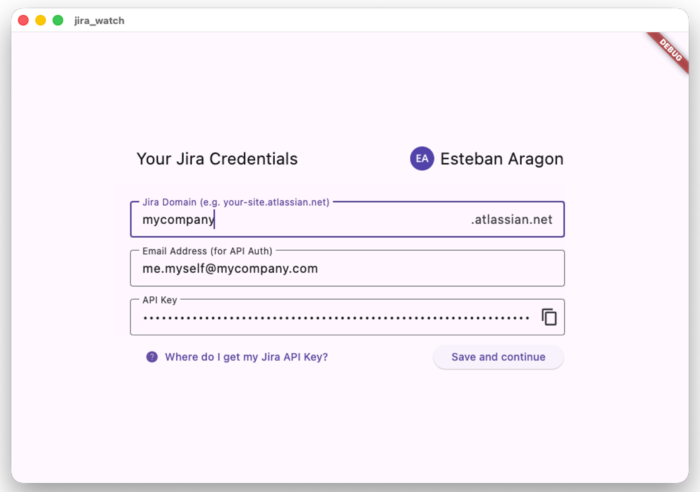

# jira_watch

A Jira client made to provide a fast and simple way to check progress across multiple Jira projects. 

Overview recent changes, search for tickets, take notes for later, all in one desktop app.

## How do I install this?

Check out the latest stable releases in this repository's [Releases](https://github.com/Este2013/jira_watch/releases/tag/1.5.0) section; and download the binaries you wish for.  
There is currently no installer for this app.

### Windows

Place the binaries in your prefered folder and run!

### macOS

Available starting in release 1.5.0.
MacOS will show a security warning and refuse to run the app (at first).
To run it anyway:
   - Close the system prompt
   - Open system settings
   - Navigate to "Privacy and security"
   - Near the bottom of the page, allow jira_watch to "Run anyway". 

## How do I log in?

To access Jira, the jira watcher needs a valid API key. 
When prompted upon starting the app, provide:
  - your company name (as registered in Atlassian);
  - your company email;
  - your API key (which will be encrypted on disk 👍): can be found [here](https://id.atlassian.com/login?continue=https%3A%2F%2Fid.atlassian.com%2Fmanage-profile%2Fsecurity%2Fapi-tokens).

When your credentials are correct, your profile picture and name will appear in the top-right:

## What's on the horizon? 

See [TODO.md](TODO.md) to see what's been though about for future development.